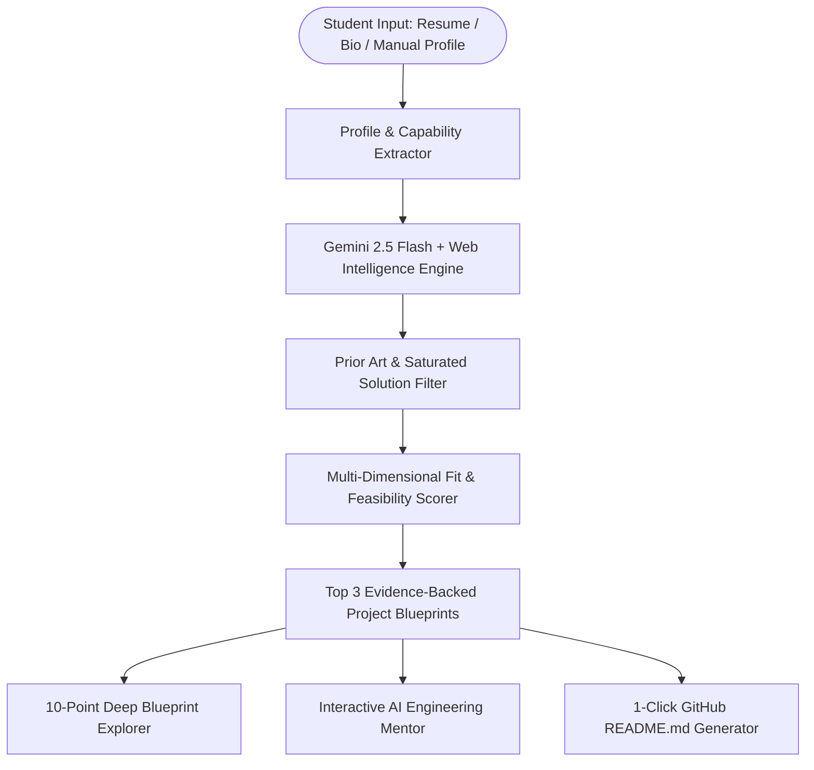

# 🧭 Project Scout
> **Universal AI Real-World Problem Discovery & Opportunity Engine for Final-Year Students**  
> *PromptWars X Parul University — CSE AIML Edition (September 5, 2026)*  
> **Author:** Shriram Reddy (`shriramreddyofficial0507@gmail.com`)

---

## 💡 Core Philosophy & Breakthrough Framing

Most AI project tools work backwards:
$$\text{Person} \longrightarrow \text{Generic AI Idea (CRUD / Wrapper / Chatbot)}$$

**Project Scout** flips this paradigm:
$$\text{Person (Capabilities \& Constraints)} \longrightarrow \text{Real-World Web Evidence Scan} \longrightarrow \text{Saturated Solution Gaps} \longrightarrow \text{Evidence-Backed Opportunity}$$

> *"We don't ask AI what project to build. We discover real-world problems backed by live web evidence, analyze existing market gaps, and identify what this specific student is uniquely capable of solving."*

---

## 🌟 Key Features

1. **Universal Across ALL Disciplines:**
   - Computer Science & AI/ML
   - Cybersecurity & Threat Intelligence
   - Healthcare, Medicine & Biotech
   - Agriculture & Climate Tech
   - Economics & Fintech
   - Law, Algorithmic Ethics & Governance
   - Literature & Digital Humanities
   - Robotics & IoT Hardware Systems

2. **Calibrated Academic Depth:**
   - **Undergraduate (UG):** High-utility working prototype, clean system design, and production deployment.
   - **Postgraduate (PG):** Empirical benchmarking, dataset curation, and comparative metrics.
   - **Doctorate (PhD):** Novel methodology, theoretical gap analysis, and publication potential.

3. **Evidence-Backed with Real-Time Web Grounding:**
   - Every discovered problem is backed by live 2025/2026 CVE advisories, PubMed papers, WHO reports, or government datasets.

4. **"Why Existing Solutions Fail" (The Gap Detector):**
   - Warns students against saturated traps ("Don't build this") and highlights uncontested high-leverage technical angles.

5. **Multi-Dimensional Project Fit Score:**
   - Transparent composite scoring: Skill Match (25%), Problem Relevance (20%), Novelty (15%), Feasibility (15%), Real-World Impact (20%), Research Potential (5%).

6. **Interactive AI Engineering Mentor:**
   - Grounded multi-turn conversational mentor ready to answer architecture questions, provide starter code, and prepare students for viva defenses.

7. **1-Click Production GitHub README Export:**
   - Instant downloadable markdown documentation with system architecture, roadmap, and resume elevator pitch.

---

## 🏗️ System Architecture



---

## 🛠️ Technology Stack

- **Frontend Framework:** React 19 + Vite + Tailwind CSS v4
- **Styling & Aesthetics:** Dark Glassmorphism 2.0, Plus Jakarta Sans, Space Grotesk
- **AI Intelligence:** Google Gemini 2.5 Flash API (`gemini-flash-latest`)
- **State Management:** Zustand
- **Animations & Delight:** Framer Motion + Canvas Confetti
- **Hosting & Deployment:** Firebase Hosting / Vercel

---

## 🚀 Running Locally

```bash
# 1. Clone the repository
git clone <YOUR_PUBLIC_REPO_URL>
cd hackathon

# 2. Install dependencies
npm install

# 3. Configure API Key
cp .env.example .env
# Add your GEMINI_API_KEY in .env

# 4. Start Development Server
npm run dev
# Open http://localhost:3000
```

---

## 🌐 Deploy to Firebase Hosting

```bash
npm run build
firebase deploy --only hosting
```

---

*Built with ❤️ for PromptWars X Parul University 2026*
