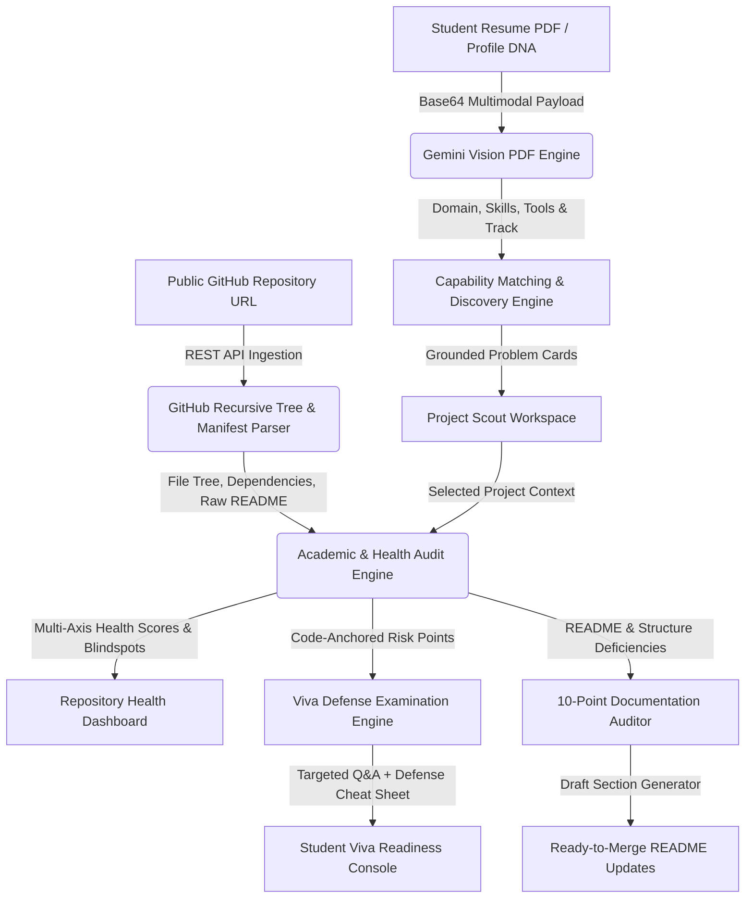

# Project Scout // AI Project Discovery, Repository Health & Viva Defense Engine

> **Project Scout** is an end-to-end AI copilot for final-year engineering and research students. It transforms student resumes and technical skillsets into high-leverage, defensible research problems, audits live GitHub repositories for academic rigor, and simulates harsh viva defense examinations anchored directly to the student's codebase.

---

## ⚡ The Problem
Final-year engineering and computer science students face two major obstacles:
1. **Weak, Generic Project Ideas**: Students struggle to identify real-world, high-leverage research problems that fit their exact skillset, often resorting to generic CRUD apps or toy AI wrappers that fail academic scrutiny.
2. **Unpreparedness for Academic Defense**: Students lack objective feedback on whether their repository, code structure, testing suite, and documentation will survive scrutiny by university examination boards and external viva committees.

Project Scout solves this end-to-end:
1. **Multimodal Resume & Skill Intake**: Gemini Vision directly scans resume PDFs or custom profiles to detect engineering competencies without manual data entry.
2. **"Why You?" Discovery Engine**: Formulates real-world, grounded problem statements with explicit capability matching ("Why You?").
3. **Live GitHub Repository Health**: Ingests recursive Git file trees and package manifests to evaluate technical execution, test coverage, and architecture.
4. **Grounded Viva Defense Interrogation**: Generates tough examiner questions anchored directly to specific files in the repository (`codeOrFileAnchor`).
5. **Documentation & README Auditor**: Audits repository documentation against the 10-point IEEE/ACM capstone rubric and generates ready-to-merge markdown sections.

---

## 🏗 System Architecture & Data Flow Diagram (DFD)

### Data Flow Diagram (Level 1 DFD)



### High-Level System Architecture

```
+---------------------------------------------------------------------------------------+
|                                    PROJECT SCOUT UI                                   |
|  +---------------------+  +----------------------+  +-------------------------------+  |
|  | Multimodal Intake   |  | Opportunity Matrix   |  | Repo Health & Defense Console  |  |
|  | - PDF Vision Upload |  | - "Why You?" Fit     |  | - Live Health Score           |  |
|  | - Fast PDF.js Mode  |  | - Technical Specs    |  | - Viva Examiner Questions     |  |
|  | - Custom Profile    |  | - 4-Phase Roadmap    |  | - 10-Point Doc Auditor        |  |
|  +---------------------+  +----------------------+  +-------------------------------+  |
+-------------------------------------------+-------------------------------------------+
                                            |
                                            v
+---------------------------------------------------------------------------------------+
|                                CORE LOGIC & ENGINES LAYER                              |
|  +---------------------------------------------------------------------------------+  |
|  | [resumeParser.js] Multimodal PDF Vision extractor & unconstrained classifier   |  |
|  | [gemini.js] Multi-stage discovery & capability grounding engine                 |  |
|  | [github.js] GitHub REST API recursive tree & dependency manifest parser        |  |
|  | [mentorEngine.js] Academic health auditor, viva interrogator & doc reviewer    |  |
|  +---------------------------------------------------------------------------------+  |
+-------------------------------------------+-------------------------------------------+
                                            |
                                            v
+---------------------------------------------------------------------------------------+
|                            EXTERNAL APIS & FAILOVER PIPELINE                          |
|  +---------------------+  +----------------------+  +-------------------------------+  |
|  | GitHub REST API v3  |  | Google Gemini Vision |  | Multi-Model Failover Loop     |  |
|  | - Tree & File Index |  | - gemini-3.7-flash   |  | 1. gemini-3.7-flash           |  |
|  | - Raw README Fetch  |  | - gemini-3.6-flash   |  | 2. gemini-3.6-flash           |  |
|  | - Manifest Parsing  |  | - gemini-flash-latest|  | 3. gemini-flash-latest        |  |
|  +---------------------+  +----------------------+  +-------------------------------+  |
+---------------------------------------------------------------------------------------+
```

---

## ✨ Key Differentiators & Features

### 1. Native Multimodal PDF Vision (Zero Manual Input)
* Ingests resume PDFs directly using Gemini Multimodal Vision (`inlineData: { mimeType: "application/pdf" }`).
* Accurately extracts programming languages, specialized tools (e.g. *Burp Suite, Wireshark, PyTorch, Docker*), and detects authentic engineering domains without artificial constraints.

### 2. "Why You?" Capability-Grounded Problem Generation
* Generates 3 rich, publication-grade problem blueprints with explicit capability justification:
  * **Core Problem Statement & Inequity**: Why this problem matters in the real world.
  * **Why You? (Skillset Match)**: Maps candidate skills directly to implementation modules.
  * **Technical Stack & Architecture**: Component-by-component software design.
  * **4-Phase Roadmap**: Step-by-step implementation milestones with verification criteria.

### 3. Live GitHub Codebase Health & Academic Audit
* Ingests real GitHub repositories (e.g. `Ram0507-Reddy/Project_Scout`) via GitHub API.
* Analyzes recursive Git trees (100+ files), dependencies, and scripts.
* Computes dual **Technical Execution** and **Academic Rigor** health scores (0–100) with critical failure points and reproducibility evaluations.

### 4. File-Anchored Viva Defense Examination
* Simulates an external university viva committee.
* Interrogates the student on real architectural choices, referencing actual files in the codebase (`Target: src/lib/gemini.js`, `Target: package.json`).
* Provides danger answers to avoid, model defense strategies, and a 30-second novelty pitch.

### 5. 10-Point Documentation & README Auditor
* Compares live repository READMEs against the 10-point capstone rubric (problem clarity, architecture, environment setup, testing, metrics, edge cases, citations).
* Automatically generates ready-to-merge markdown drafts for missing sections.

---

## 🚀 Tech Stack & Structure

- **Frontend**: React 18, Vite 6, Tailwind CSS, Lucide Icons, Canvas Confetti
- **AI Runtimes**: Google Gemini Multimodal APIs (`gemini-3.7-flash`, `gemini-3.6-flash`, `gemini-flash-latest`)
- **Document Processing**: Native Gemini Multimodal Vision API + PDF.js client-side fallback
- **State Management**: Zustand with persistent storage
- **Repository Ingestion**: GitHub REST API v3 recursive tree engine

```
src/
├── components/          # Reusable UI components
│   ├── DocAuditorView.jsx        # Live 10-point README auditor
│   ├── MentorChatConsole.jsx     # Grounded multi-turn mentor workspace
│   ├── OpportunityCard.jsx       # 3-tier problem cards with "Why You?" fit
│   ├── OpportunityDetailModal.jsx# Complete blueprint & system design
│   ├── ProfileBuilder.jsx        # Multimodal PDF upload & intake switcher
│   ├── ProjectHealthView.jsx     # Live repository health & category radar
│   ├── RepoConnectModal.jsx      # GitHub repository ingestion modal
│   ├── RoadmapNextStepsView.jsx  # Milestone tracker & execution plan
│   └── VivaDefenseView.jsx       # Codebase-anchored viva examination
├── lib/                 # Core engines & services
│   ├── gemini.js                 # Gemini problem discovery engine
│   ├── github.js                 # GitHub REST API tree parser & analyzers
│   ├── mentorEngine.js           # Academic auditor, viva generator & chat
│   ├── pdfHelper.js              # Client-side PDF text extraction
│   ├── resumeParser.js           # Gemini Vision multimodal PDF parser
│   └── store.js                  # Zustand application state
└── assets/              # Premium custom graphics & illustrations
```

---

## 🛠 Quickstart Guide

### 1. Clone the Repository
```bash
git clone https://github.com/Ram0507-Reddy/Project_Scout.git
cd Project_Scout
```

### 2. Install Dependencies
```bash
npm install
```

### 3. Configure API Key
Create a `.env` file in the root directory:
```env
VITE_GEMINI_API_KEY=your_gemini_api_key_here
```

### 4. Start Development Server
```bash
npm run dev
```
Open `http://localhost:3000` (or `http://localhost:5173`) in your browser.

---

## 📦 Production Build
```bash
npm run build
```
Builds an optimized static bundle ready for deployment on Vercel, Netlify, or Firebase Hosting.
