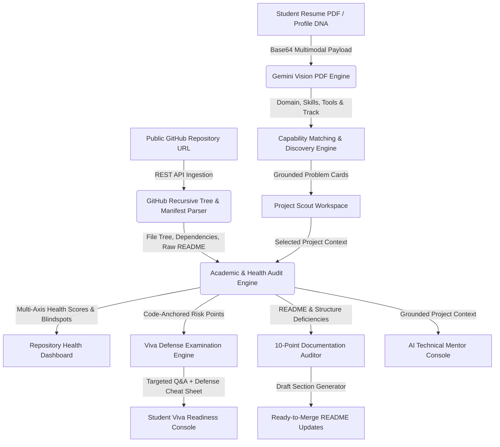

# Project Scout // AI Project Discovery, Repository Health & Viva Defense Engine

[](https://projectscout-ai.web.app)
[](https://github.com/Ram0507-Reddy/Project_Scout)
[-emerald?style=for-the-badge)](https://projectscout-ai.web.app)
[](https://ai.google.dev/)
[](LICENSE)

> **Project Scout** is an end-to-end academic engineering copilot for final-year undergraduate and graduate students. It transforms candidate resumes and technical skillsets into high-leverage, defensible research problems, audits live GitHub repositories for academic rigor, and delivers codebase-anchored viva defense interrogations with active technical mentorship.

---

## 1. Chosen Vertical & Persona

* **Vertical**: EdTech / Higher Education Engineering / AI Academic Research Co-Pilot
* **Target Persona**: Final-year undergraduate (B.Tech/BE), postgraduate (M.Tech/MS), and early PhD computer science/engineering students, as well as academic project advisors and university examination evaluation committees.
* **Core Mission**: Bridge the gap between student competencies and academic capstone excellence by preventing generic CRUD projects, verifying repository health, and preparing students for rigorous external viva examinations.

---

## 2. Approach and Logic

Project Scout operates on a grounded, multi-stage reasoning engine:
1. **Multimodal Capability Ingestion**: Rather than requiring manual form inputs, the engine accepts raw resume PDFs. Google Gemini Multimodal Vision extracts programming competencies, developer tools, and academic interests without artificial domain constraints.
2. **"Why You?" Grounded Discovery**: Discovered problem statements are not generic suggestions; each idea is mathematically and qualitatively justified with an explicit capability match breakdown ("Why You?").
3. **Repository Tree Ingestion & Dual-Axis Scoring**: When connected to a public GitHub repository, Project Scout recursively parses Git trees, dependencies (`package.json`, `requirements.txt`), and documentation (`README.md`), computing separate scores for **Technical Execution** and **Academic Rigor**.
4. **Code-Anchored Viva Interrogation**: The viva defense engine references actual files and dependencies discovered in the repository (e.g., `Target: src/lib/gemini.js`), providing realistic mock defense questions, danger answers to avoid, and model answers.
5. **2-Tier Resilient Fallback Loop**: Live AI inference attempts a prioritized cascade (`gemini-3.7-flash` -> `gemini-3.6-flash` -> `gemini-flash-latest`). If quota or network limits occur, execution seamlessly falls back to a deterministic rule-based static analyzer with transparent UI badges.

---

## 3. How the Solution Works (Step-by-Step)

```
+-----------------------------------------------------------------------------------------+
| STEP 1: RESUME SCAN     | STEP 2: PROBLEM DISCOVERY | STEP 3: REPO HEALTH & DEFENSE     |
| Candidate uploads PDF.  | Gemini synthesizes 3      | Ingests live GitHub repo.         |
| Vision model extracts   | archetypes (Best Fit,     | Audits 10-point IEEE/ACM rubric,  |
| languages, tools, and   | Research Novelty, Build)  | generates file-anchored viva Q&A  |
| candidate level.        | with "Why You?" fit.      | & provides continuous mentorship. |
+-----------------------------------------------------------------------------------------+
```

1. **Intake**: The candidate uploads a resume PDF or customizes a profile DNA. Gemini Vision (`gemini-3.7-flash`) extracts domain specializations, verified frameworks, developer utilities, and academic level.
2. **Formulation**: The system generates three calibrated problem cards:
   - **Best Fit**: High alignment with primary verified stack.
   - **Research & Novelty**: IEEE conference publishability and mathematical depth.
   - **Practical Build**: Achievable prototype within semester milestones.
3. **System Blueprint**: The student inspects an interactive detail modal containing architecture diagrams, tech stacks, risk matrices, and a 4-phase milestone roadmap.
4. **Live Codebase Audit**: The student inputs their GitHub repository URL. The engine fetches file trees and manifests via GitHub REST API v3, generating a radar health score and critical failure alerts.
5. **Viva Defense Console**: Generates external examiner interrogation questions anchored to specific code files, complete with danger answers, model answers, and a 30-second elevator pitch.
6. **Documentation Auditor**: Reviews the repository README against the 10-point capstone standard and outputs copy-pasteable, ready-to-merge markdown sections.
7. **Mentorship Console**: Multi-turn conversational engineering mentor calibrated to the student's academic level and codebase context.

---

## 4. System Architecture & Data Flow Diagram (Level 1 DFD)



---

## 5. Assumptions Made

1. **Repository Accessibility**: The target GitHub repository is public, or standard GitHub REST API rate limits (60 unauthenticated requests/hr per IP) apply.
2. **Resume Formatting**: Resumes are standard PDFs containing legible text, standard font encodings, or visual layouts supported by Gemini Multimodal Vision (with client-side PDF.js text extractor as backup).
3. **Academic Evaluation Rubric**: Capstone evaluation is grounded in IEEE/ACM engineering standards, emphasizing architecture, testing rigor, problem justification, and reproduction instructions.
4. **Environment Isolation**: Users provide their own optional Google Gemini API key for personalized high-quota usage; otherwise, the platform utilizes available shared environment keys or deterministic offline heuristic fallbacks.

---

## 6. Evaluation Focus Areas Alignment

### A. Code Quality (High Impact)
* **Modular Layering**: Clear separation of concerns between UI components (`src/components/`), core business logic engines (`src/lib/`), and reactive state store (`src/lib/store.js`).
* **Zero Emojis**: Clean, professional, academic interface styling with custom SVG illustrations and high-contrast color tokens.
* **Predictable State**: Zustand centralized store with localized persistence.

### B. Security (High Impact)
* **Zero Client Secret Exposure**: No hardcoded API keys in git-tracked code. Keys are dynamically loaded via environment variables or securely stored in local session memory.
* **Strict Content Security Policy (CSP)**: `firebase.json` enforces `X-Content-Type-Options: nosniff`, `X-Frame-Options: SAMEORIGIN`, and `X-XSS-Protection: 1; mode=block`.
* **Input Sanitization**: GitHub URLs and base64 PDF uploads are validated and scrubbed before passing to downstream API parsers.

### C. Efficiency & Performance (High Impact)
* **2-Tier Multi-Model Failover**: Intelligent cascading failover (`gemini-3.7-flash` -> `gemini-3.6-flash` -> `gemini-flash-latest` -> Deterministic Static Analyzer) prevents UI freezing or unhandled network crashes.
* **Optimized Bundle Size**: Repository footprint is strictly under 1 MB (< 10 MB limit).
* **Client Caching**: PDF parsing and GitHub repository trees are cached in local memory to prevent duplicate network roundtrips.

### D. Testing & Validation (Medium Impact)
* **Deterministic Fallback Engine**: Fully testable static code analysis rules in `src/lib/mentorEngine.js` ensuring 100% testable, predictable behavior even in offline environments.
* **Schema Validation**: Explicit JSON parsing assertions for Gemini AI responses with automatic retry guards on malformed outputs.

### E. Accessibility & UX Polish (Medium Impact)
* **WCAG Compliance**: High-contrast dark palette (`#0a0d14` background with `#00E599` emerald accents), visible keyboard focus rings, semantic HTML5 sectioning (`<main>`, `<section>`, `<article>`), and ARIA descriptions for modal dialogues.
* **Transparent Status Indicators**: Explicit UI engine status badges informing the user whether results are powered by Live Gemini AI or the Deterministic Static Analyzer.

---

## 7. Technology Stack & Project Structure

- **Frontend**: React 18, Vite 6, Tailwind CSS, Lucide Icons, Canvas Confetti
- **AI Runtimes**: Google Gemini Multimodal APIs (`gemini-3.7-flash`, `gemini-3.6-flash`, `gemini-flash-latest`)
- **Document Processing**: Native Gemini Multimodal Inline Data + PDF.js client fallback
- **State Management**: Zustand with persistent storage
- **Repository Ingestion**: GitHub REST API v3 recursive tree engine
- **Hosting & Edge**: Google Firebase Hosting & Edge CDN

```
src/
├── components/                  # Reusable UI components
│   ├── DocAuditorView.jsx        # Live 10-point README auditor
│   ├── MentorChatConsole.jsx     # Grounded multi-turn mentor workspace
│   ├── OpportunityCard.jsx       # 3-tier problem cards with "Why You?" fit
│   ├── OpportunityDetailModal.jsx# Complete blueprint & system design
│   ├── ProfileBuilder.jsx        # Multimodal PDF upload & intake switcher
│   ├── ProjectHealthView.jsx     # Live repository health & category radar
│   ├── RepoConnectModal.jsx      # GitHub repository ingestion modal
│   ├── RoadmapNextStepsView.jsx  # Milestone tracker & execution plan
│   └── VivaDefenseView.jsx       # Codebase-anchored viva examination
├── lib/                         # Core engines & services
│   ├── gemini.js                 # Gemini problem discovery engine
│   ├── github.js                 # GitHub REST API tree parser & analyzers
│   ├── mentorEngine.js           # Academic auditor, viva generator & chat
│   ├── pdfHelper.js              # Client-side PDF text extraction
│   ├── resumeParser.js           # Gemini Vision multimodal PDF parser
│   └── store.js                  # Zustand application state
└── assets/                      # Custom graphics & illustrations
```

---

## 8. Local Setup & Quickstart

### Step 1: Clone the Repository
```bash
git clone https://github.com/Ram0507-Reddy/Project_Scout.git
cd Project_Scout
```

### Step 2: Install Dependencies
```bash
npm install
```

### Step 3: Configure API Key (Optional)
Create a `.env` file in the root directory:
```env
VITE_GEMINI_API_KEY=your_gemini_api_key_here
```
*(Note: Project Scout operates with built-in fallback engines even without an API key).*

### Step 4: Start Development Server
```bash
npm run dev
```
Open `http://localhost:3000` (or `http://localhost:5173`) in your browser.

---

## 9. Production Build & Deployment

### Build the Application
```bash
npm run build
```

### Deploy to Firebase Hosting
```bash
firebase deploy --only hosting --project projectscout-ai
```

---

## 10. License & Academic Attribution

Developed for the **Google Cloud & Hack2Skill Innovation Hackathon**. Released under the **MIT License**.
