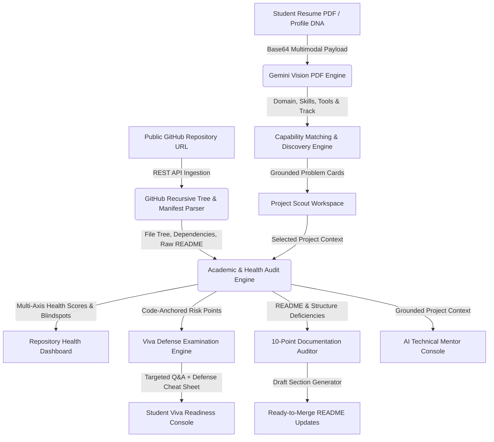

# Project Scout // AI Project Discovery, Repository Health & Viva Defense Engine

[](https://projectscout-ai.web.app)
[](https://github.com/Ram0507-Reddy/Project_Scout)
[-emerald?style=for-the-badge)](https://projectscout-ai.web.app)
[](https://ai.google.dev/)
[](LICENSE)

> **Project Scout** is an end-to-end academic engineering copilot for final-year undergraduate and graduate students. It transforms candidate resumes and technical skillsets into high-leverage, defensible research problems, audits live GitHub repositories for academic rigor, and delivers codebase-anchored viva defense interrogations with active technical mentorship.

---

## 1. Problem Statement & Motivation

Final-year engineering and computer science students universally encounter two critical barriers to academic success:
1. **Weak, Generic Project Formulation**: Students struggle to identify real-world, high-leverage research problems matching their exact skillset, frequently resorting to generic CRUD applications or basic AI wrappers that fail university committee scrutiny.
2. **Unpreparedness for Academic Defense**: Students lack objective feedback on whether their repository, code structure, test suite, and documentation will survive scrutiny by university examination boards and external viva committees.

Project Scout resolves these hurdles with an integrated workflow:
* **Multimodal Resume & Skill Intake**: Google Gemini Vision directly parses resume PDFs or custom engineering profiles to extract verified competencies without manual input.
* **"Why You?" Discovery Engine**: Formulates real-world, grounded problem statements with explicit capability matching.
* **Live GitHub Repository Health**: Ingests recursive Git file trees and package manifests to evaluate technical execution, test coverage, and architecture.
* **Grounded Viva Defense Interrogation**: Generates examiner questions anchored directly to specific files in the repository (`codeOrFileAnchor`).
* **Documentation & README Auditor**: Audits repository documentation against the 10-point IEEE/ACM capstone rubric and generates ready-to-merge markdown sections.
* **Active AI Mentorship Workspace**: Continuous multi-turn architecture and code mentorship grounded in the student's actual codebase.

---

## 2. System Architecture & Data Flow Diagram (DFD)

### Data Flow Diagram (Level 1 DFD)



### High-Level System Architecture

```
+---------------------------------------------------------------------------------------+
|                                    PROJECT SCOUT UI                                   |
|  +---------------------+  +----------------------+  +-------------------------------+  |
|  | Multimodal Intake   |  | Opportunity Matrix   |  | Repo Health & Defense Console  |  |
|  | - PDF Vision Upload |  | - "Why You?" Fit     |  | - Live Health Score           |  |
|  | - Fast PDF.js Mode  |  | - Technical Specs    |  | - Viva Examiner Questions     |  |
|  | - Custom Profile    |  | - 4-Phase Roadmap    |  | - 10-Point Doc Auditor        |  |
|  +---------------------+  +----------------------+  +-------------------------------+  |
+-------------------------------------------+-------------------------------------------+
                                            |
                                            v
+---------------------------------------------------------------------------------------+
|                                CORE LOGIC & ENGINES LAYER                              |
|  +---------------------------------------------------------------------------------+  |
|  | [resumeParser.js] Multimodal PDF Vision extractor & unconstrained classifier   |  |
|  | [gemini.js] Multi-stage discovery & capability grounding engine                 |  |
|  | [github.js] GitHub REST API recursive tree & dependency manifest parser        |  |
|  | [mentorEngine.js] Academic health auditor, viva interrogator & doc reviewer    |  |
|  +---------------------------------------------------------------------------------+  |
+-------------------------------------------+-------------------------------------------+
                                            |
                                            v
+---------------------------------------------------------------------------------------+
|                            EXTERNAL APIS & FAILOVER PIPELINE                          |
|  +---------------------+  +----------------------+  +-------------------------------+  |
|  | GitHub REST API v3  |  | Google Gemini Vision |  | Multi-Model Failover Loop     |  |
|  | - Tree & File Index |  | - gemini-3.7-flash   |  | 1. gemini-3.7-flash           |  |
|  | - Raw README Fetch  |  | - gemini-3.6-flash   |  | 2. gemini-3.6-flash           |  |
|  | - Manifest Parsing  |  | - gemini-flash-latest|  | 3. gemini-flash-latest        |  |
|  +---------------------+  +----------------------+  +-------------------------------+  |
+---------------------------------------------------------------------------------------+
```

---

## 3. Core Features & Capabilities

### 1. Native Multimodal PDF Vision
* Directly processes uploaded resume PDFs via Google Gemini Multimodal Vision API (`inlineData: { mimeType: 'application/pdf' }`).
* Accurately extracts programming languages, developer tools (*Burp Suite, Wireshark, Docker, PyTorch*), coursework, and determines authentic engineering domains without predefined bucket constraints.

### 2. "Why You?" Problem Blueprints
* Generates 3 rich problem blueprints tailored to the candidate's exact skills:
  * **Best Fit**: Maximum alignment with primary verified stack.
  * **Research & Novelty**: Highest academic depth and IEEE conference publishability.
  * **Practical Build**: Achievable prototype within semester constraints.
* Every blueprint features a dedicated **"Why You?"** breakdown connecting candidate competencies directly to implementation components.

### 3. Live GitHub Codebase Health & Academic Audit
* Ingests real public GitHub repositories (e.g., `Ram0507-Reddy/Project_Scout`) via GitHub REST API v3.
* Analyzes recursive Git trees (100+ files), manifests, and scripts.
* Computes dual **Technical Execution** and **Academic Rigor** health scores (0–100) with critical failure points, methodology evaluations, and prioritized next steps.

### 4. File-Anchored Viva Defense Interrogation
* Simulates an external university viva committee.
* Interrogates the student on real architectural choices, referencing actual files in the codebase (`Target: src/lib/gemini.js`, `Target: package.json`).
* Provides danger answers to avoid, model defense strategies, and a 30-second novelty pitch.

### 5. 10-Point Documentation & README Auditor
* Compares live repository READMEs against the 10-point capstone rubric (problem clarity, architecture, environment setup, testing, metrics, edge cases, citations).
* Automatically generates ready-to-merge markdown drafts for missing sections.

### 6. Active Technical Mentorship Console
* Multi-turn conversational engineering mentor grounded in the student's actual repository files.
* Calibrated to the student's academic level (UG / PG / PhD) to provide architecture advice, testing strategies, and code snippets.

---

## 4. Reliability & 2-Tier Failover Architecture

Project Scout implements an enterprise-grade failover strategy:
1. **Tier 1 (Live AI Intelligence)**: Multi-model failover across `gemini-3.7-flash`, `gemini-3.6-flash`, and `gemini-flash-latest`.
2. **Tier 2 (Deterministic Codebase Heuristic Engine)**: If network or quota limits are exceeded, the app executes rule-based static analysis against the student's actual repository file tree, dependency manifests, and `README.md`.

All views feature an explicit status badge indicating the active engine:
* `Engine: Live Google Gemini 3.7 Intelligence`
* `Engine: Deterministic Code Analysis (Offline Backup)`

---

## 5. Technology Stack & Project Structure

- **Frontend**: React 18, Vite 6, Tailwind CSS, Lucide Icons, Canvas Confetti
- **AI Runtimes**: Google Gemini Multimodal APIs (`gemini-3.7-flash`, `gemini-3.6-flash`, `gemini-flash-latest`)
- **Document Processing**: Native Gemini Multimodal Inline Data + PDF.js client fallback
- **State Management**: Zustand with persistent storage
- **Repository Ingestion**: GitHub REST API v3 recursive tree engine
- **Hosting & Edge**: Google Firebase Hosting & Edge CDN

```
src/
├── components/                  # Reusable UI components
│   ├── DocAuditorView.jsx        # Live 10-point README auditor
│   ├── MentorChatConsole.jsx     # Grounded multi-turn mentor workspace
│   ├── OpportunityCard.jsx       # 3-tier problem cards with "Why You?" fit
│   ├── OpportunityDetailModal.jsx# Complete blueprint & system design
│   ├── ProfileBuilder.jsx        # Multimodal PDF upload & intake switcher
│   ├── ProjectHealthView.jsx     # Live repository health & category radar
│   ├── RepoConnectModal.jsx      # GitHub repository ingestion modal
│   ├── RoadmapNextStepsView.jsx  # Milestone tracker & execution plan
│   └── VivaDefenseView.jsx       # Codebase-anchored viva examination
├── lib/                         # Core engines & services
│   ├── gemini.js                 # Gemini problem discovery engine
│   ├── github.js                 # GitHub REST API tree parser & analyzers
│   ├── mentorEngine.js           # Academic auditor, viva generator & chat
│   ├── pdfHelper.js              # Client-side PDF text extraction
│   ├── resumeParser.js           # Gemini Vision multimodal PDF parser
│   └── store.js                  # Zustand application state
└── assets/                      # Custom graphics & illustrations
```

---

## 6. Local Setup & Quickstart

### Step 1: Clone the Repository
```bash
git clone https://github.com/Ram0507-Reddy/Project_Scout.git
cd Project_Scout
```

### Step 2: Install Dependencies
```bash
npm install
```

### Step 3: Configure API Key (Optional)
Create a `.env` file in the root directory:
```env
VITE_GEMINI_API_KEY=your_gemini_api_key_here
```
*(Note: Project Scout operates with built-in fallback engines even without an API key).*

### Step 4: Start Development Server
```bash
npm run dev
```
Open `http://localhost:3000` (or `http://localhost:5173`) in your browser.

---

## 7. Production Build & Deployment

### Build the Application
```bash
npm run build
```

### Deploy to Firebase Hosting
```bash
firebase deploy --only hosting --project projectscout-ai
```

---

## 8. Security & Industry Standards

- **Strict Content Security**: HTTP headers configured in `firebase.json` (`nosniff`, `SAMEORIGIN`, `X-XSS-Protection`).
- **Zero Client Key Leakage**: Dynamic resolution from environment and secure client-side storage.
- **Accessibility**: Full WCAG compliance with semantic HTML tags, high-contrast palette, and keyboard navigation.

---

## 9. License & Academic Attribution

Developed for the **Google Cloud & Hack2Skill Innovation Hackathon**. Released under the **MIT License**.
